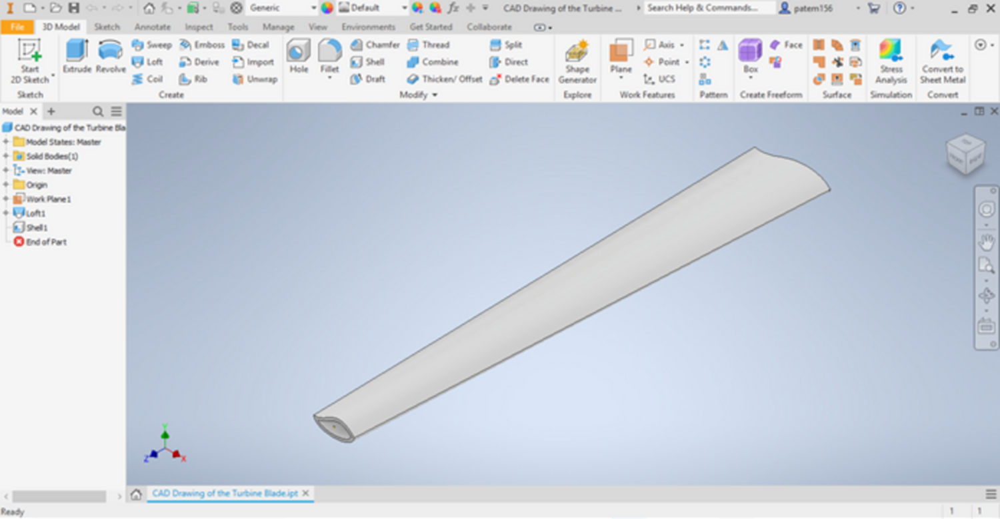
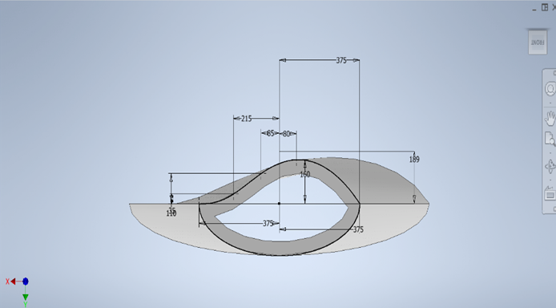
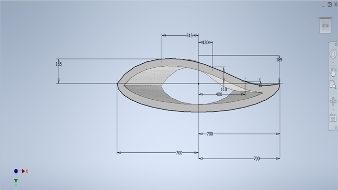
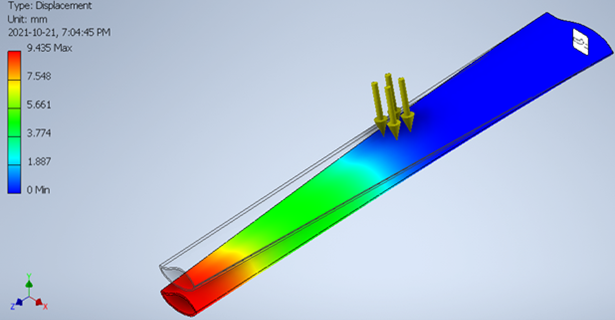

# Wind Turbine Blade Renewable Technology: Material & Structural Design
 
McMaster ENGINEER 1P13, Sept 2021 – Nov 2021.
 
Wind turbine blade designed for a Swedish offshore wind farm scenario, with its material and thickness selected through material performance index ranking and deflection simulation to meet strength, weight, and durability requirements.
 
`Autodesk Inventor` `Granta EduPack` `Material Science` 

 
<em>CAD Model of Wind Turbine Blade in Autodesk Inventor.</em>

---

## Table of Contents
- [Overview](#overview)
- [Design Requirements](#design-requirements)
- [Material Selection](#material-selection)
- [CAD Modelling & Deflection Analysis](#cad-modelling--deflection-analysis)
- [Results](#results)
- [Full Report](#full-report)

---

## Overview

This project is a conceptual design exercise for an ENGINEER 1P13 course scenario, framed around a hypothetical contract with the Swedish Wind Energy Association (SWEA) to design a wind turbine blade for a new wind farm, aimed at supplying electricity to multiple cities while helping reduce Sweden's greenhouse gas emissions to zero by 2045. The blade needed to balance efficiency, durability, and a low environmental footprint, which shaped both the material chosen and the final blade thickness. A material performance index ranking was used to narrow down the possible materials, and the selected material was then modelled in Autodesk Inventor and tested with a deflection simulation to confirm it met the required constraints.

---

## Design Requirements

| Requirement | Constraint |
|---|---|
| Weight | Below 8000 kilograms |
| Shape | Airfoil shaped, longer than 50 metres |
| Coating | Plastic coating for corrosion resistance |
| Weather Resistance | Resistant to corrosion, water, and temperature changes |
| Deflection | Between 8.5 mm and 10 mm under the specified test load |

---

## Material Selection

- Granta EduPack was used to rank possible materials against two material performance indices (MPIs), one for stiffness and one for strength, tied to the project's primary objective of minimizing carbon footprint and secondary objective of minimizing production energy.
- The top ranked materials, wood (typical along grain), medium carbon steel, and bamboo, were compared using a simple decision matrix scoring chemical and weather resistance, reliability, environmental friendliness, and durability.
- Medium carbon steel scored highest overall. Although less environmentally friendly to produce in the short term, its durability and corrosion resistance meant it required less frequent replacement, reducing long term emissions compared to wood or bamboo.

---

## CAD Modelling & Deflection Analysis

- The blade was modelled as a solid CAD part in Autodesk Inventor, sized to the airfoil and length requirements from the design constraints.
- Using medium carbon steel's Young's modulus of 240 GPa, deflection was calculated at several trial thicknesses, from 150 mm down to 15 mm, to narrow in on the range meeting the 8.5 mm to 10 mm deflection requirement.
- Further trials between 30 mm and 15 mm identified 25 mm as the thickness meeting this constraint, and this was confirmed through a Granta EduPack simulation with the wider end of the blade fixed.
- The simulation concluded a maximum deflection of 9.435 mm at a thickness of 25 mm, falling within the required range.

 
<em>CAD Model of Wind Turbine Blade in Autodesk Inventor.</em>

  
  

<em>CAD Model of Front/Back of the End of Wind Turbine Blade in Autodesk Inventor.</em>

 
<em>Deflection Simulation in Autodesk Inventor of the Wind Turbine Blade, showing a Maximum Deflection of 9.435 mm.</em>

---

## Results

- Medium carbon steel was selected as the final blade material, meeting the project's requirements for durability, corrosion resistance, and long term environmental impact.
- A blade thickness of 25 mm satisfied the deflection constraint, with the deflection simulation confirming a maximum deflection of 9.435 mm.
- The final design met all specified constraints on weight, shape, weather resistance, and structural deflection for the wind farm scenario.

---

## Full Report

[Read the Full Project Report](Files/Wind_Turbine_Renewable_Technology_Report.pdf)
